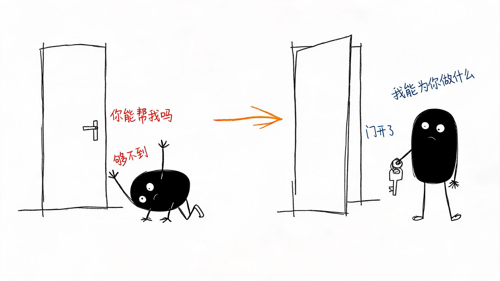
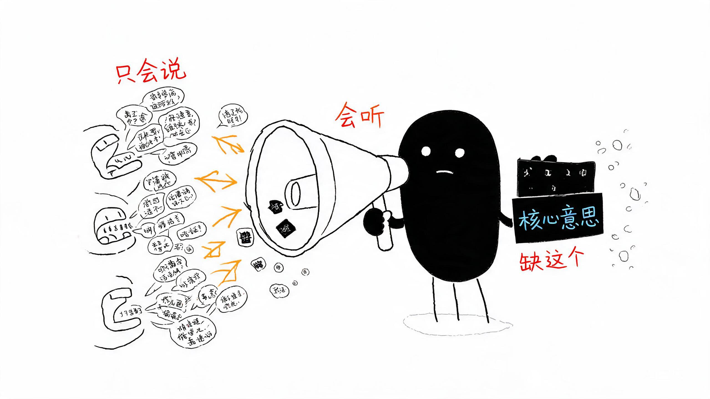
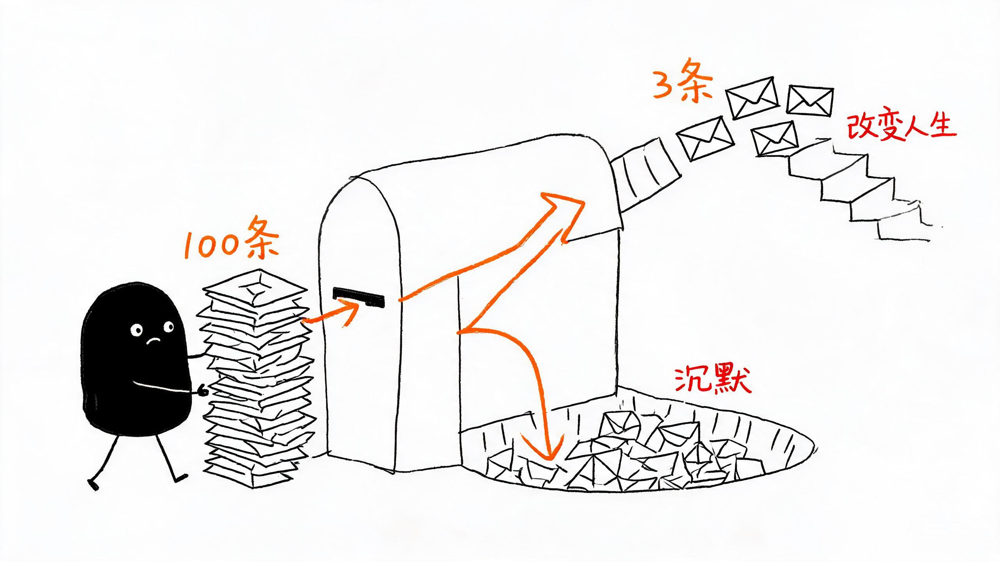
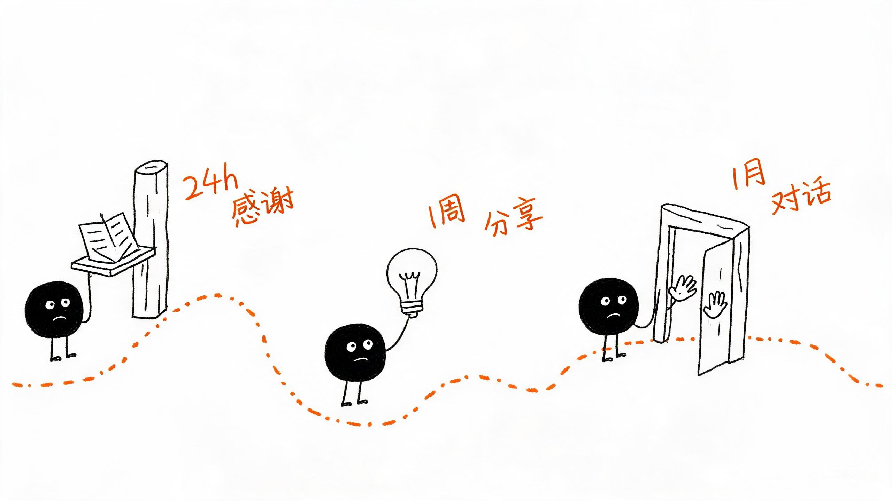
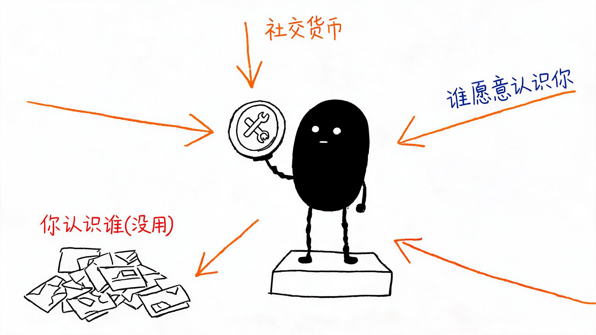
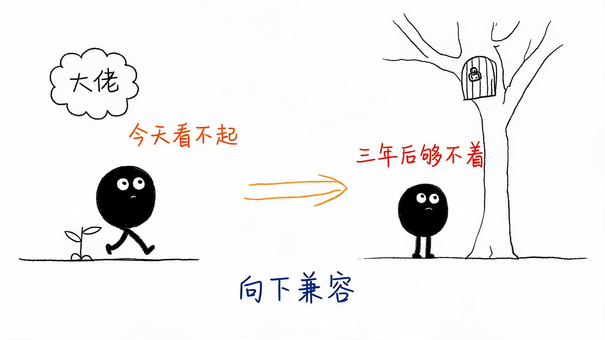
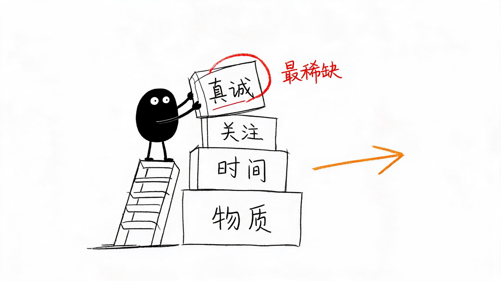
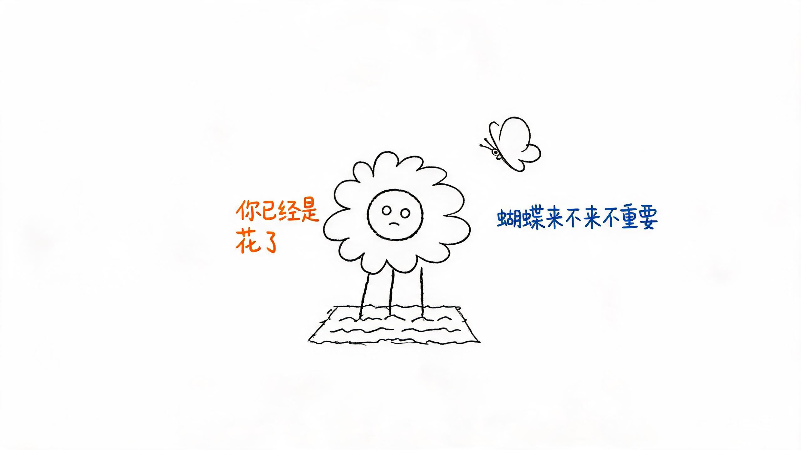

你越是想巴结谁，谁就越看不上你跪着的人永远够不到高处。真正的向上社交，不是攀高枝，不是舔，而是——先问自己一句：我能为你做什么？

## 01

看到"向上社交"四个字，你的第一反应是什么？我猜，大概率是——这不就是教人"攀高枝"吗？说实话，我第一次听到这个词也是这个反应。但读完《向上社交》之后，我发现自己错了。而且错得离谱。书里有一句话，我记了很久："你越是想巴结谁，谁就越看不上你；你越是不需要谁，谁反而想认识你。"反直觉？扎心？但这就是社交场上的真相。直觉是动物本能，反直觉才是人的智慧。

## 02

大多数人一听到"向上社交"，脑子里蹦出来的画面就是：低声下气、递名片、敬酒、群发"在吗"。这叫"跪着社交"。

跪着是"你能帮我吗"，站着是"我能为你做什么"。前者是乞讨，后者是合作。跪着的人，永远够不到高处。有人会说：可我什么都没有啊，我就是一个普通打工人，月薪八千，没背景没资源，我拿什么跟大佬合作？这就是第二个认知陷阱——"我什么都没有"。你有一张嘴吗？你会听吗？你能帮人跑个腿、查个资料、整理一份文档吗？这些算什么价值？算情绪价值和执行价值。大佬最缺的不是钱，是时间。是有人能听懂他在说什么，然后帮他落地。

## 03

说到"听"，这是整本书最让我汗颜的部分。作者说：向上社交的第一步，不是说话，是闭嘴。你试试，下次跟一个比你高两个阶层的人聊天，他说完之后，你能不能准确复述出他的核心意思？大多数人做不到。因为大多数人一辈子都在说，从来没学会听。而大佬身边从来不缺说话的人，缺的是——能听懂他说话的人。一个会听的人，比十个会说的人的社交价值更高。

## 04

还有一个现实问题：很多人不敢主动社交，是因为怕被拒绝。加了一个大佬的微信，他没回。你难受了三天。但你知道他那边发生了什么吗？他可能根本没看到。看到了可能忘了回。忘了回不代表拒绝你，可能只是他那天太累了。你以为的丢脸，在别人眼里连个水花都没有。更残酷也更真实的数据是：有个三线城市的小姑娘，想进互联网行业。她给100个行业前辈发了私信，只有3个人回了。其中一个人愿意跟她聊15分钟。就这15分钟，她问了三个问题，记了满满两页笔记。半年后，这个人帮她内推了一份工作。100条消息，97%的沉默，3%改变了她的人生。很多人发了一次没回就放弃了。所以大多数人一辈子都在底层——不是命运不公，是你自己先放弃了。

## 05

那加了微信之后，怎么把关系"养"住？别做那个"平时不说话，有事突然冒出来问'在吗能帮个忙吗'"的人。平时不烧香，临时抱佛脚，佛也嫌你烦。教你一个**"三次触达法则"**：

- 第一次：加完微信24小时内，发一条有针对性的感谢或反馈
- 第二次：一周内，分享一个跟他相关的有价值的信息
- 第三次：一个月内，提出一个具体的小请求或小对话

比如："您上次推荐的XX书我看了，有个观点想跟您确认一下。"——这不是请求，这是对话。对话才是关系的开始。

## 06

很多人觉得社交就是"混圈子"。但"混"进去的，永远是边缘。真正进去的，是靠实力走进去的。你不需要什么惊天动地的实力。你有没有一项技能，哪怕很小，能做到比身边80%的人都好？会做PPT、英语好、信息检索强、做饭好吃——这些全都是你的社交货币。社交的本质不是你认识谁，而是——谁愿意认识你。把这句话反过来想：你有什么，是别人愿意来认识你的？如果现在想不出来，那就去学一个，学精一个。这就是你社交能力的起点。

## 07

还有一个被严重低估的社交策略：向下兼容。很多人拼命想认识比自己厉害的人，但对身边不如自己的人，爱答不理。你今天看不起的人，三年后可能就是你够不着的人。你身边那个不起眼的实习生，三年后可能成了某公司的合伙人。你当年对他爱答不理，现在想认识他？门都没有。对不如你的人好一点，不是施舍，是投资。向下兼容，才是最高级的向上社交。

## 08

聊了这么多方法，最后我想说一个最核心的东西。向上社交最核心的两个字，是——先给。给不起物质，就给时间。给不起时间，就给关注。给不起关注，就给真诚。真诚是最贵的社交货币。因为太稀缺了。有人担心：真诚会不会被人利用？被人利用说明你有价值。没人利用你，才是最大的悲哀。被人利用了怎么办？长记性，下次不给他利用了。但你还是真诚——**真诚但不傻，开放但不乱。**这就是社交的最高境界。

## 09

最后，回到一个终极问题：向上社交的终点，是什么？不是你认识了谁。而是——你通过这些人，成为了更好的自己。所有社交，最终都要回到你自己身上。你认识了再多大佬，自己没长进，一切归零。向上社交不是往上爬踩着别人，是往上走带着别人。你若盛开，蝴蝶来不来不重要，重要的是——你已经是花了。

## 10

如果你觉得自己的社交能力很差，从今天开始，只做三件事：

- ✅ 清理微信——把三年没说过话、加了也没意义的人分组或删除
- ✅ 给三个人发消息——给三个你真正想维护的人，发一条有内容的消息
- ✅ 问自己一个问题——"我有什么，是别人需要的？"

任何事，做一天叫体验，做三十天叫习惯，做一年叫蜕变。社交能力的蜕变，从今天开始。你今天准备给谁发那条"有内容的消息"？你有什么，是别人需要的？欢迎在评论区聊聊你的答案 👇如果这篇文章对你有启发，点个**「在看」**，把它转给那个总在"跪着社交"的朋友。

**推荐阅读**

- 《向上社交》[1]

**引用链接**

[1] 《向上社交》: https://u.jd.com/k16LycS
